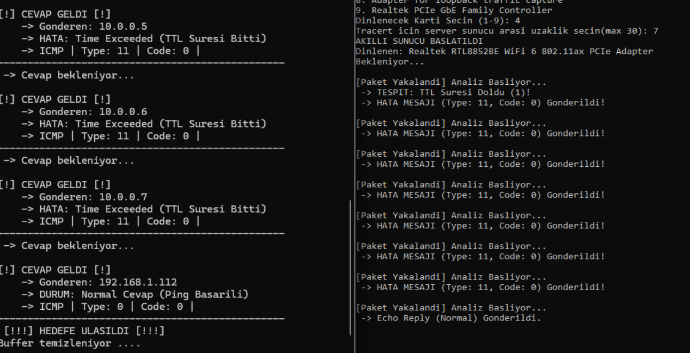
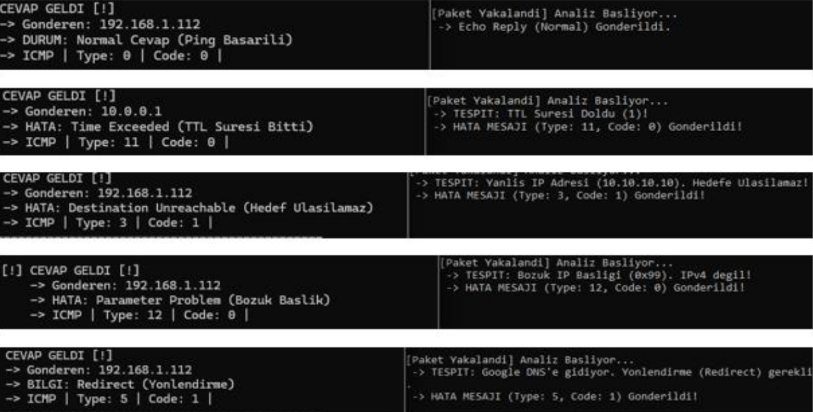
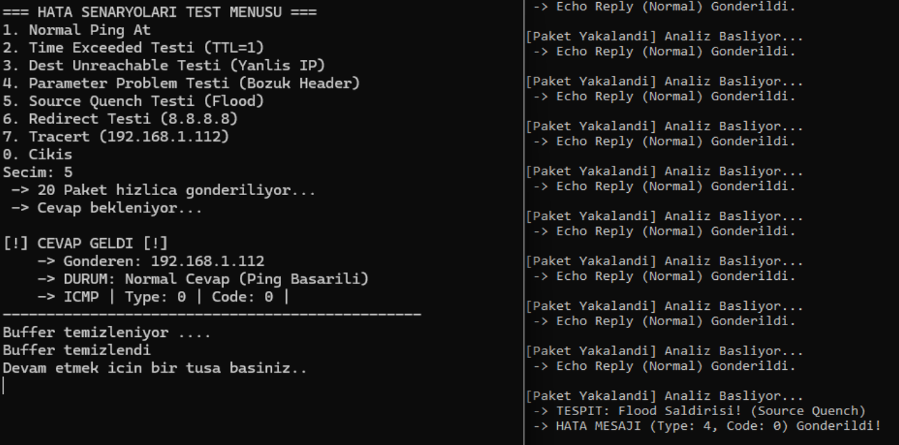

# ICMP İstemci-Sunucu Uygulaması

>  Bu proje [Ders Adı/Tarih] kapsamında geliştirilmiş olup, portfolyo arşivlemesi amacıyla GitHub'a sonradan aktarılmıştır.

## 1. Uygulama Tanıtımı

### 1.1. Projenin Amacı
Bu projenin amacı, `libpcap` kütüphanesi kullanılarak TCP/IP protokol yığınının Ağ katmanında çalışan ICMP protokolünü manipüle edebilen bir İstemci-Sunucu mimarisi geliştirmektir. Uygulama; ham paket oluşturma, ağ trafiğini dinleme, paket başlıklarını analiz etme ve çeşitli hata senaryolarını simüle etme yeteneklerine sahiptir.

### 1.2. Kullanılan Yöntem ve Teknolojiler
Uygulama **C** programlama dili ile geliştirilmiştir. Ağ kartı ile doğrudan iletişim kurabilmek için `libpcap` kütüphanesinden faydalanılmıştır.

- **İstemci:** Ethernet, IP ve ICMP başlıklarını bayt seviyesinde manuel olarak oluşturur. Kullanıcının seçtiği senaryoya göre paketi şekillendirir ve ağa bırakır. Ardından, sadece kendi gönderdiği işlem kimliğine (PID) sahip cevap paketlerini dinler.
- **Sunucu:** Ağ kartını dinleyerek gelen ICMP Echo Request paketlerini yakalar. Gelen paketin TTL değerini, IP adresini ve başlık yapısını kontrol eder. Senaryoya uygun olarak bir hata veya başarı (Echo Reply) cevabı üretip istemciye geri gönderir.
- **Tracert Algoritması:** İstemci, TTL değerini 1'den başlatıp artırarak paketler gönderir. Sunucu, TTL süresi dolan paketler için sanal router IP'leri üzerinden Time Exceeded cevabı dönerek gerçek bir yol izleme işlemini simüle eder.

### 1.3. Desteklenen ICMP Senaryoları ve Hata Yönetimi
Proje kapsamında, standart Echo Request/Reply döngüsünün yanı sıra, ağda karşılaşılabilecek çeşitli hata durumları da simüle edilmiştir. Sunucu, gelen paketlerin durumuna göre RFC standartlarına uygun aşağıdaki ICMP cevaplarını üretmektedir:

- **Type 0 (Echo Reply):** Hedef ve paket geçerli ise dönülen standart başarılı cevap.
- **Type 3 (Destination Unreachable):** Hedef IP sunucunun kendi IP'si değilse ve yönlendirme (Redirect) gerekmiyorsa üretilen hata.
- **Type 4 (Source Quench):** Kısa sürede çok fazla paket gönderildiğinde (Flood koruması) istemciyi yavaşlatmak için üretilen uyarı.
- **Type 5 (Redirect):** Hedef IP belirli bir adres (Örn: `8.8.8.8`) ise, trafiğin başka bir ağ geçidine yönlendirilmesi gerektiğini bildiren mesaj.
- **Type 11 (Time Exceeded):** Paketin TTL (Time to Live) süresi dolduğunda üretilen hata.
- **Type 12 (Parameter Problem):** IP başlığında uyumsuzluk veya bozukluk tespit edildiğinde üretilen hata.

## 2. Uygulama Çalışma Görüntüleri

Aşağıda uygulamanın çalışmasına dair test ve analiz görüntüleri yer almaktadır.

### Tracert İşlemi

*Şekil 1: İstemci tarafında Tracert işlemi başlatılmış, Sunucu tarafında TTL süreleri dolan paketlere sanal router IP'leri ile cevap verilmiştir.*

### ICMP Senaryoları ve Hata Yönetimi Testleri

*Şekil 2: Geliştirilen uygulama üzerinde gerçekleştirilen temel ICMP senaryoları ve hata yönetimi testleri. Simüle edilen durumlar:*
- **Normal Ping:** Standart Echo Request/Reply döngüsünün başarıyla tamamlanması.
- **Time Exceeded:** TTL değeri 1 olarak gönderilen paketin sunucu tarafından düşürülmesi ve "Time Exceeded (Type 11)" cevabının dönülmesi.
- **Destination Unreachable:** Tanımlı olmayan bir hedef IP adresine gönderilen pakete sunucunun "Destination Unreachable (Type 3)" hatası ile cevap vermesi.
- **Parameter Problem:** IP başlığı kasten bozuk (0x99) gönderilen paketin sunucu tarafından tespit edilip "Parameter Problem (Type 12)" hatası üretilmesi.
- **Redirect:** Yönlendirme gerektiren bir IP adresine (Google DNS - 8.8.8.8) istek yapıldığında sunucunun "Redirect (Type 5)" bilgisi dönmesi.

### Flood Saldırısı ve Source Quench

*Şekil 3: Flood saldırısı denemesi ve Source Quench testi. İstemci, 20 adet paketi bekleme yapmadan arka arkaya göndermiş; sunucu paketlerin aşırı sık geldiğini "Flood Saldırısı" olarak algılamış ve istemciye yavaşlaması gerektiğini bildiren "Source Quench (Type 4)" mesajı göndererek trafiği dengelemiştir.*
